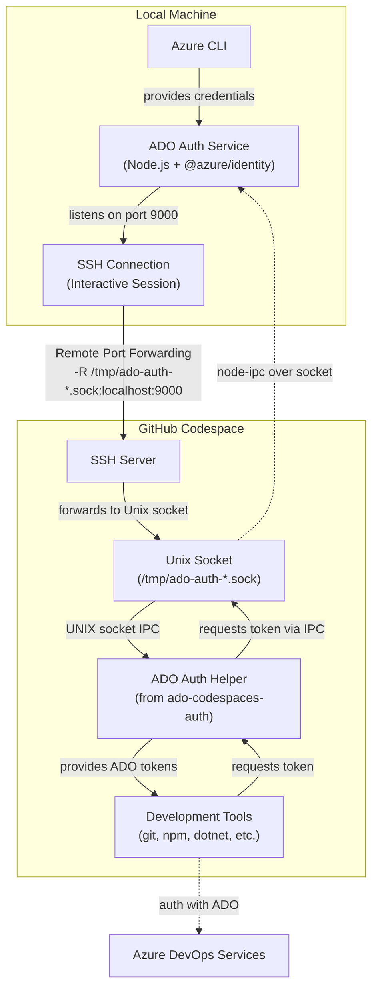
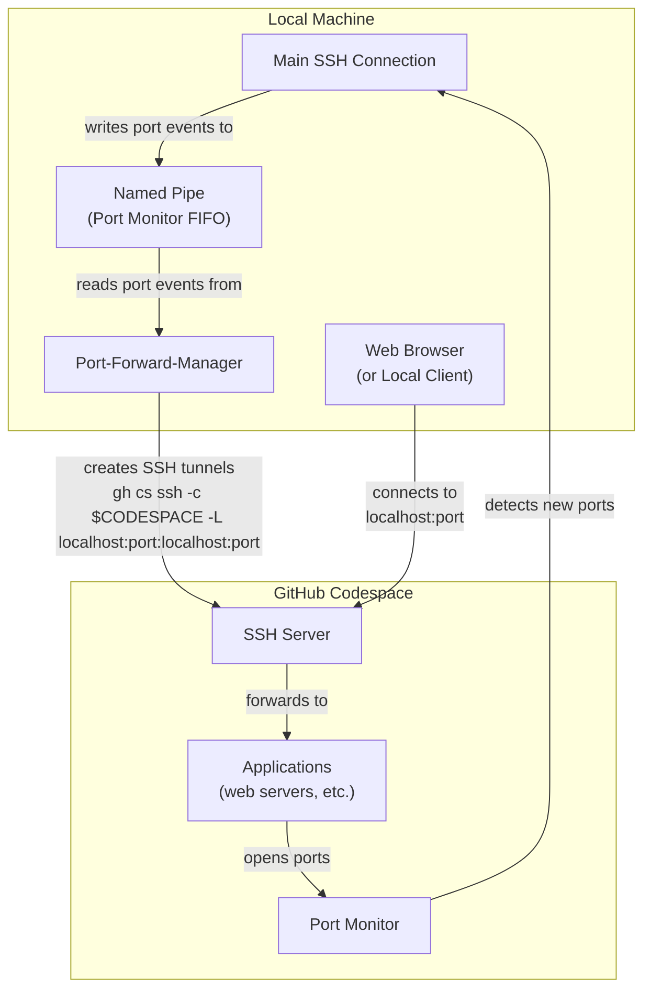

# ADO SSH Auth for GitHub Codespaces

A tool that enables Azure DevOps (ADO) authentication with GitHub Codespaces via SSH connections, without requiring VS Code (ish).

## Overview

This project provides authentication to Azure DevOps services when working with GitHub Codespaces over SSH. It leverages the Azure CLI credentials on your local machine and establishes a secure channel to make them available inside your codespace.

While solutions like the [Azure DevOps Codespaces Authentication](https://github.com/microsoft/ado-codespaces-auth) extension and [Artifacts Helper](https://github.com/microsoft/codespace-features/tree/main/src/artifacts-helper) exist, they are designed for VS Code.

This tool brings similar capabilities to regular SSH sessions. By leveraging their work.

- [Azure DevOps Codespaces Authentication](https://github.com/microsoft/ado-codespaces-auth) setup an ado-auth-helper script in the codespace that uses [node-ipc](https://github.com/RIAEvangelist/node-ipc) to request an ADO access token from the extension running in VS Code. We recreate the service outside of VS Code, so it can still request access tokens, but without VS Code running.
- [Artifacts Helper](https://github.com/microsoft/codespace-features/tree/main/src/artifacts-helper) adds authentication wrappers around commands like `yarn` and `npm`. They leverage the ado-auth-helper script provided by the ADO Codespaces Authentication extension.

This tool does not *yet* provide the ado-auth-helper script, so initial configuration of the codespace with VS Code is still required. However, once the codespace is set up, you can use this tool to authenticate without needing to run VS Code.

## Requirements

- GitHub CLI (`gh`) installed and authenticated
- Azure CLI (`az`) installed and logged in to the appropriate tenant
- `fzf` for interactive codespace selection

## Installation

1. Clone this repository
2. Build the authentication service:

   ```bash
   cd ado-ssh-auth
   yarn install
   yarn build
   ```

## Usage

Make sure to use the Azure CLI to login and setup to be able to request access tokens:

```bash
az login --scope 499b84ac-1321-427f-aa17-267ca6975798/.default
```

Then, run the `ado-gh-session` script to start a session:

```bash
./ado-gh-session
```

The script will:

1. Start the local auth service
2. Prompt you to select a GitHub Codespace
3. Establish a secure port forwarding channel for authentication
4. Start an interactive SSH session
5. Automatically forward other detected application ports from the codespace to your local machine.

Inside your codespace, tools like `git`, `npm`, and NuGet will automatically use the authentication provided by this service through the tooling provided by [Artifacts Helper](https://github.com/microsoft/codespace-features/tree/main/src/artifacts-helper).

## How It Works

Under the hood, this tool provides two main functionalities: Azure DevOps authentication and automatic port forwarding.

### Authentication Flow

The authentication system enables tools inside your codespace to securely access Azure DevOps resources using your local credentials:



1. **Local Authentication Service**: A Node.js service using the `@azure/identity` package connects to your Azure CLI credentials and listens for token requests
2. **SSH Socket Forwarding**: An SSH connection forwards the local authentication service to a Unix socket in the codespace using remote socket forwarding
3. **Token Delivery**: Development tools inside the codespace request tokens through the ADO Auth Helper, which communicates with your local authentication service

### Automatic Port Forwarding

The port forwarding system automatically detects and forwards application ports from your codespace:



1. **Port Detection**: The `port-monitor` service runs in your codespace and detects when applications start listening on network ports
2. **Event Communication**: Port events are sent through the main SSH connection to a named pipe (FIFO) on your local machine
3. **Tunnel Creation**: The `port-forward-manager` script reads from the FIFO and creates SSH tunnels (`gh cs ssh -L`) for each detected port
4. **Local Access**: Applications running in your codespace become accessible via `localhost:<port>` on your local machine

This approach leverages the same tools and workflows that the official ADO Codespaces authentication helpers provide, while adding seamless port forwarding capabilities.

## Adding Additional Port Forwarding

If you need to forward additional ports from your codespace, you can open another terminal and run:

```bash
codespace="your-codespace-name" # The name from 'gh cs ls'
gh cs ssh -c "$codespace" -- -L local_port:localhost:remote_port -N
```

## Limitations

- Authentication is tied to your local Azure CLI session
